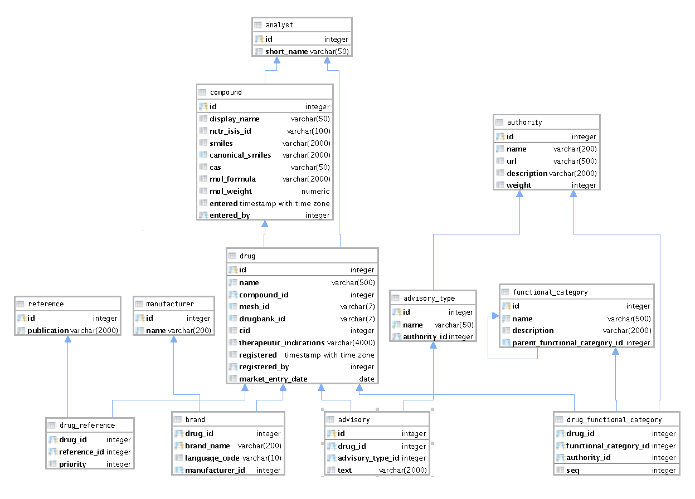

# Generate SQL/JSON Queries and Matching Types

## Fetch nested data spanning any number of related tables via a single query
This tool generates SQL/JSON queries, which can fetch complex nested data from
any number of related tables in a single query operation with the database. 

## No runtime library necessary (other than what you probably already have)
The queries are generated as plain SQL text, as part of the application build
phase typically. The SQL can then be included in an application as static
resources and executed directly in the DMBS via plain JDBC, etc, with no extra
library needed at run-time. 

## Result type generation
Types can be generated for each query which match the results precisely,
including only the fields actually selected in each part of the query, and their
nullability as derived from database metadata. The query results can be directly
serialized to the top result type using common libraries, such as Jackson in 
Java.

## Track database changes with confidence (at build time)
The database metadata, which is generated by the tool, also allows
validation of table and field names and table relationships referenced in a
query specification. This gives a high degree of confidence that the queries and
types generated are consistent with the state of the database structure, at
build time.

## Workflow
1) Generate database metadata, stored in a json or yaml file. This should be
done whenever the database has changes that should be incorporated.
2) Create a queries specification file, describing for each query a starting or
"top" table, its fields to be included, any parent and child tables of
the top table, fields and parent and child tables of those parent and child
tables, and so on to any depth.
3) Run the tool specifying the above two files and the output directories for
the generated SQL and source code files. This step can be run as part of the
application build process.
4) At application run time, load the SQL resource file for a query, submit to
the database, specifying any embedded parameter values, and deserialize results
to the generated top level type for the query.

## Isn't that what joins are for?
If we limit ourselves to "rectangular" results of rows and columns of simple
types, which most database access libraries do, then joins seem to be the
solution to the problem of pulling related data from multiple tables in a single
query. However joins are not the right tool for fetching data for the important
case that data from *independent child tables* of a parent table are needed in
a query. In this case joins suffer from a combinatorial explosion in the number
of result rows, yielding the product of the number of child rows involved
whereas ideally they would only contribute their sum (at most) to the results.
Likewise the join approach would produce a large amount of duplicated data which
would have to be "de-convolved" in the receiving client from the combinations
introduced by the cartesion product operation. Definitely using joins for such
a case would be inefficient, tedious, and error-prone.

## Example

TODO: diagram showing independent child tables
 N1 + N2 + N3 results for SQL/JSON
 N1 * N2 * N3 from a join.

